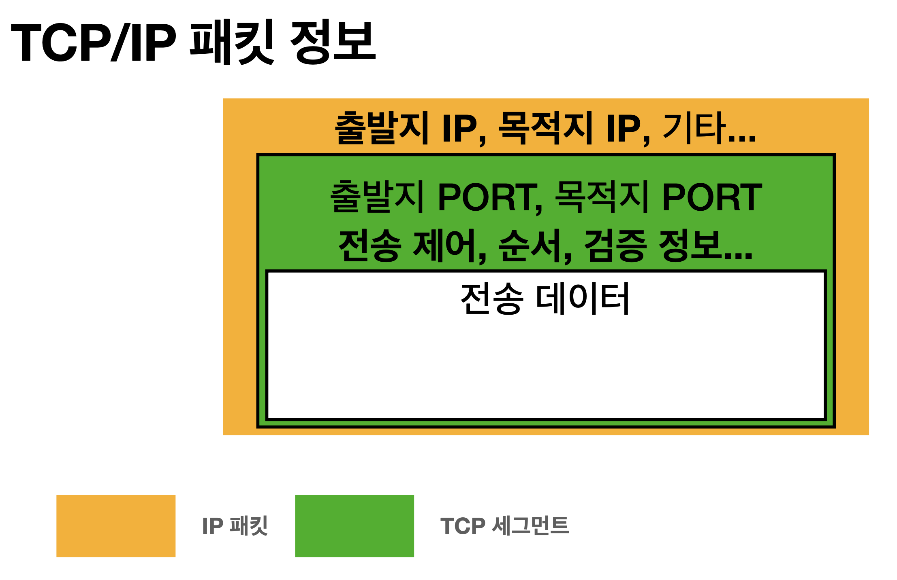

# 인터넷 네트워크

- 인터넷 통신
- IP
- TCP, UDP
- PORT
- DNS

* * *

## 1-1. 인터넷에서 컴퓨터끼리 어떻게 통신할까?

두 대의 컴퓨터(클라이언트와 서버)가 직접 데이터를 주고 받는 것이 아닌 그 사이에 있는 인터넷망을 통해 데이터를 주고 받는다. 이 때 사용되는 공통된 규약(프로토콜)이 바로 **IP**다.


## 1-2. IP (인터넷 프로토콜)

- 지정한 **IP 주소**에서 클라이언트와 서버가 패킷 교환 네트워크에서 메세지(데이터)를 주고 받는데 사용하는 정보 위주의 네트워크 규약(프로토콜)
    - IP 주소는 각 장치의 고유 번호, 쉽게 말하면 주민등록번호다.
- **IP 패킷**이라는 통신 단위로 나뉘어 데이터를 전달한다.
    - IP 패킷 정보에는 전송 데이터, 출발지 IP, 목적지 IP 등이 담겨있다.
    - IP 패킷은 제어 정보(헤더)와 사용자 데이터(페이로드)로 이루어져있다.

### IP 프로토콜의 한계

- 비연결성
    - 패킷을 받을 대상의 상태를 알지 못한다.
        - 패킷을 받을 대상이 없거나(ex. 서버가 꺼져있는 상태) 서비스 불능 상태여도 패킷을 전송한다.
- 비신뢰성
    - 흐름에 관여하지 않기 때문에 보낸 정보가 제대로 갔는지 보장하지 않는다.
        - 패킷 소실
            - 전송 과정에 패킷(서버)이 손상되도 알 수 없다.
        - 패킷 전달 순서 변경
            - 1500 바이트가 넘으면 패킷 단위를 쪼개서 보내는데, 이때 나뉜 패킷들이 모두 동일한 Node(경로)로 가지 않아 패킷 순서가 뒤죽박죽이 될 수 있다.
- 프로그램 구분
    - 같은 IP로 여러개의 서비스를 사용하고 있을 때 어떤 애플리케이션인지 구분을 하는데 한계가 있다.

위와 같은 IP의 한계를 보완해주는 것이 **TCP 프로토콜**이다.

## 1-3. TCP/UDP

### 인터넷 프로토콜 스택의 4계층


- IP 위에 TCP를 더해 IP의 한계를 보완해준다.
    - 메세지 데이터 -> TCP 정보 생성 + 메세지 데이터 -> IP 패킷을 생성하고 전달

### TCP 특징

> 전송 제어 프로토콜(Transmission control protocol)

1. 연결 지향적
    - TCP 3 way handshake: 가상 연결
2. 데이터 전달 보증
    - 도착하는 각 패킷의 수신을 확인하고 수신이 확인되지 않은 누락된 패킷은 다시 전송한다.
3. 모든 패킷의 순서 보장

#### 1. TCP 3 way handshake

TCP/IP 프로토콜을 이용해서 통신을 하는 프로그램이 데이터를 전송하기 전에 정확한 전송을 보장하기 위해 상대방 컴퓨터와 사전에 세션을 수립하는 과정이다.

```text
* 연결 과정
  1. 클라이언트가 서버에게 SYN(접속 요청)
  2. 서버가 클라이언트에게 SYN + ACK(요청 수락)
  3. 클라이언트가 서버에게 ACK
```


- 서로 연결된 것이 확인되야지만 요청을 보낼 수 있다.
- 요즘은 3번 ACK를 전송할 때 데이터도 함께 보낸다.

#### 2. 데이터 전달 보증과 3. 순서 보장

- 데이터를 전송하면 서버에서 잘 받았다는 메세지를 보내준다.
- 중간에 순서가 잘못되면 잘못된 순서부터 다시보낸다.



> 이 모든 것이 가능한 이유는 TCP 정보에 검증 정보들이 추가되어 있기 때문이다. TCP는 신뢰할 수 있는 프로토콜이다.

### UDP 특징

> 사용자 데이터그램 프로토콜(User Datagram protocol)

- 하얀 도화지와 같다. 즉, 기능이 거의 없다.
- IP와 같지만 IP엔 없는 **PORT**가 있다.
    - 하나의 IP에 여러 패킷이 올 때 어떤 애플리케이션인지 구분할 수 있다.
    - 체크섬(=메세지 검증) 가능하다.
- UDP는 아무런 기능이 없어서 직접 기능을 확장해서 사용할 수 있다.

## 1-4. PORT(= 항구)

IP 단독으로는 한 대의 클라이언트에서 여러대의 서버에게 패킷을 받았을 때 어느 서버에서 온 패킷인지 구분하기 어렵다. 하지만 TCP/IP 패킷엔 출발지와 도착지의 **PORT**가 존재한다. IP는 목적지의 서버를
찾고, 해당 서버 안에서 돌아가는 애플리케이션을 구분하는 것이 PORT다.


- 웹 브라우저가 200.200.200.3 IP의 80포트 서버에게 페이지를 요청하면 서버는 웹 브라우저가 요청할 때 보낸 패킷 정보를 확인하여 100.100.100.1 IP의 10010포트에 HTML 문서(데이터)
  를 전송한다.

> IP는 아파트고 PORT는 사람들이 사는 동과 호수다. 즉, IP는 한 아파트에 사는 사람들의 주소를 구분해준다.

## 1-5. DNS(Domain Name System)

> IP 주소는 기억하기 어렵고 변경되기도 한다. 이런 IP의 전화번호부 역할을 하는 것이 **DNS**다.

- DNS 서버에 도메인 명을 등록하면 도메인 명을 IP 주소로 변환해준다.

