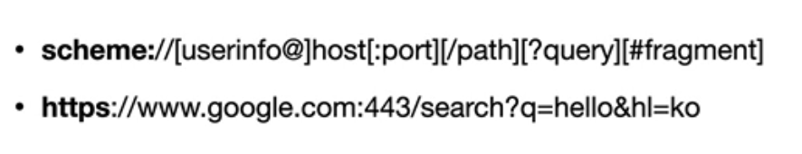
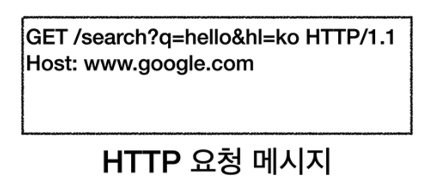
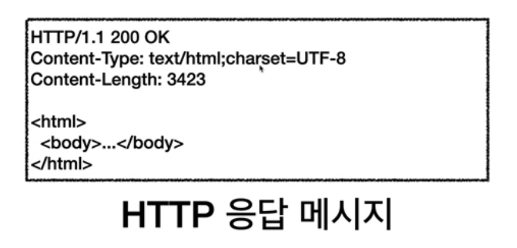

# URI와 웹 브라우저 요청 흐름

- URI
- 웹 브라우저 요청 흐름

* * *

## 2-1. URI(Uniform Resource Identifier)

URI? URL? URN?

- **URI**:
  - **U**niform: 리소스 식별하는 통일된 방식
  - **R**esource: 자원, URI로 식별할 수 있는 모든 것
  - **I**dentifier: 다른 항목과 구분하는데 필요한 정보
- URL(Resource Locator): 리소스가 있는 위치
  - URL === URI
- URN(Resource Name): 리스소에 이름을 부여
  - URN 만으로는 실제 리소스를 찾기 어렵다.

### URL 전체 문법

- **scheme**: 주로 프로토콜을 사용, 프로토콜은 어떤 방식으로 자원에 접근할 것인가 하는 약속 규칙
  - http는 80포트, https는 443 포트를 주로 사용함 
  - https는 http에 보안을 강화한 버전 
- **userinfo**: URL에 사용자 정보를 포함해서 인증할 때 씀, 거의 사용 안함
- **host**: 도메인명, IP 주소
- **port**: 접속 포트
- **path**: 리소스 경로, 계층적 구조로 되어 있음
  - ex) /home/file1.jpg, /users, /users/1 
- **query**: key value의 형태로 데이터가 들어감, ?로 시작하고 &로 추가한다.
  - query parameter, query string 으로 불림, 웹서버에 제공하는 파라미터, 문자 형태
- **fragment**: html 내부 북마크 등에서 사용되고 서버로 전송되지 않는다.

## 2-2. 웹 브라우저 요청 흐름

> https://www.google/com/search?q=hello&hi=ko

사용자가 브라우저에 위와 같은 주소를 입력하면,

1. 웹 브라우저는 DNS 서버를 조회한다. 
   1. IP/PORT 정보를 찾고 **HTTP 요청 메세지**를 생성한다.
2. TCP/ID 연결 후 데이터 전달
3. TCP/ID 패킷 생성 + HTTP 메세지 포함
4. 웹 브라우저 서버에서 구글 서버로 HTTP 요청 메세지를 보낸다.
5. 구글 서버에서 웹 브라우저에게 받은 TCP/ID 요청 패킷을 받으면, TCP/IP 패킷을 까고 안에 있는 HTTP 메세지를 읽는다. 
6. 구글 서버에서 **HTTP 응답 메세지**를 생성하고 TCP/IP 패킷을 씌우고 응답 패킷을 웹 브라우저 서버에게 보낸다.
7. 응답 패킷을 전달 받은 웹 브라우저 서버는 HTTP 메세지를 확인하고 HTML을 렌더링한다. 

