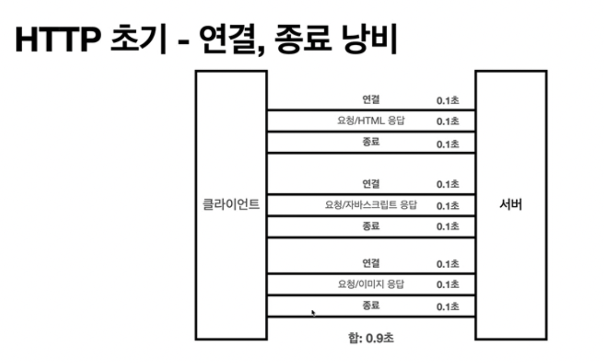
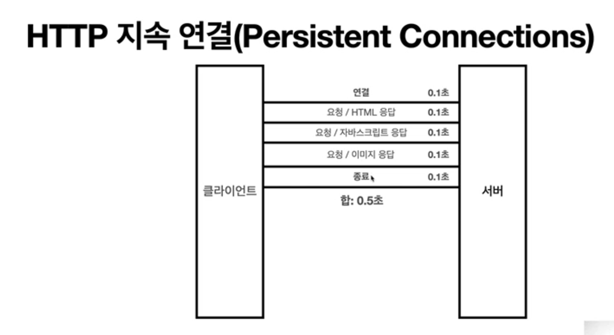

# HTTP 기본

- 모든 것이 HTTP
- HTTP 특징
  - 클라이언트 서버 구조
  - Stateful, Stateless
  - 비 연결성(connectionless)
- HTTP 메세지

---

## 3-1. HTTP(HyperText Transfer Protocol)

- 처음엔 HTML, Text를 전송할 때 썼지만 지금은 이미지, 음성, 영상, JSON, 서버 간의 통신까지 거의 모든 형태의 데이터 전송이 가능하다.

### HTTP 기반 프로토콜

- TCP: HTTP/1.1 (가장 많이 사용되며 대부분의 기능이 해당 버전에서 추가 됨), HTTP/2 (성능 개선)
- UDP: HTTP/3 (TCP 대신 UDP 사용, 성능 개선)

HTTP/3는 TCP의 핸드쉐이크, 큰 데이터 등의 성능을 개선하기 위해 UDP 프로토콜을 사용한다.

## 3-2. HTTP 특징

## 클라이언트 서버 구조

| 💡         | 역할                  |
| ---------- | --------------------- |
| 서버       | 비즈니스 로직, 데이터 |
| 클라이언트 | UI, UX                |

- 서로 독립적인 구조
- Request Response 구조
  - 클라이언트가 서버에 데이터를 요청하고 서버에게 응답을 받는 형태로 이루어진다.

## 무상태 프로토콜

### 상태 유지(Stateful)

- 서버가 클라이언트의 이전 상태를 유지하는 것
- 항상 같은 서버를 유지해야한다.
  - 중간에 서버에 장애가 나면 처음부터 다시해야함

### 무상태(Stateless)

- 클라이언트의 이전 상태를 유지하지 않는 것
- 무상태는 응답 서버를 쉽게 바꿀 수 있다.(= 무한한 서버 증설 가능)
- 스케일 아웃, 수평 확장 유지
  - ex) 이벤트 설계 시 서버를 여러대로 늘릴 수 있음

#### 무상태의 단점

- 상태 유지가 필요할 경우
  - ex) 로그인한 사용자의 상태를 서버에 유지해야 할 때
    - 브라우저 쿠키와 서버 세션이 이를 보완해준다.
- 전송하는 데이터량이 크다.
  - 전에 보냈었던 데이터를 포함해서 요청을 하기 때문에 상태 유지보다 전송 데이터의 양이 크다.

### 비연결성(connectionless)

- TCP/IP의 경우 연결을 유지한다.
  - 연결에 단점은, 필요하지 않은 연결을 유지함으로써 불필요한 자원을 소모한다.
- HTTP는 기본적으로 연결을 유지하지 않는다.
  - 서버가 연결을 유지하지 않으면, 최소한의 자원으로 효율적으로 사용 가능하다.

#### 비연결성 장점

- 수천명이 같은 시간에 서비스를 사용해도 빠르게 응답 가능
  - 실제 서버에서 동시에 처리하는 요청은 작기 때문이다.
  - ex) 웹 브라우저에서 계속해서 검색 버튼을 누르지 않는다.
- 서버 자원을 매우 효율적으로 사용 가능

#### 비연결성 단점

- TCP/IP 연결을 매번 새로 맺어야함 (3 way 핸드쉐이크 시간)
- 브라우저로 사이트를 요청할 때마다 html 뿐만 아니라 js, css, 이미지 등 여러 자원을 각각 다운로드 받기 때문에 시간이 오래 걸린다.

현재는 HTTP 지속 연결(Persistent Connections)로 문제 해결
HTTP/2, 3에서 더 많은 최적화 되었다.




> 💡 이벤트 설계할 땐 **스테이스 리스**한 방식으로 설계하는 것이 중요하다.
>
> ex) 첫 페이지는 정적 페이지를 노출시켜 사용자가 해당 페이지에 머무를 수 있도록 하고 특정 버튼을 눌렀을 때만 이벤트 페이지에 접속해 서버 과부하를 줄이기

## 3-3. HTTP 메세지

### HTTP 메세지 구조

```
start-line
header
empty line (CRLF)
message body
```

- 시작 라인
  - 요청 메세지
    - (request line = method SP(=공백) request-target SP HTTP-version CRLF(=엔터))
      - HTTP 메서드, 서버가 수행할 동작 지정 (GET, POST, PUT...)
      - 요청 대상, absolute-path(= 절대경로[?쿼리]), 절대 경로("/")로 시작하는 경로
      - HTTP 버전
  - 응답 메세지
    - (status-line = HTTP-version SP status-code SP reason-phrase CRLF)
      - HTTP 버전
      - 상태 코드, 요청 성공 또는 실패를 나타냄
      - 이유 문구, 사람이 이해할 수 있는 짧은 상태 코드 설명 글
- HTTP 헤더
  - header-filed = file-name ":" OWS filed-value OWS (OWS: 띄어쓰기 허용)
  - field-name 은 대소문자 구분이 없음
  - HTTP 전송에 필요한 모든 부가 정보가 들어있음
  - ex. 메세지 바디의 내용, 메세지 바디의 크기, 압축, 인증, 요청 클라이언트 정보, 서버 애플리케이션 정보, 캐시 관리 정보 등
- HTTP 메세지 바디
  - 실제 전송할 데이터, byte로 표현할 수 있는 모든 데이터

## 🎄🎅 정리

- HTTP는 정말 단순하다. 메세지도 매우 단순해서 보기도 쉽다.
- 지금은~? HTTP 시대~~~!
