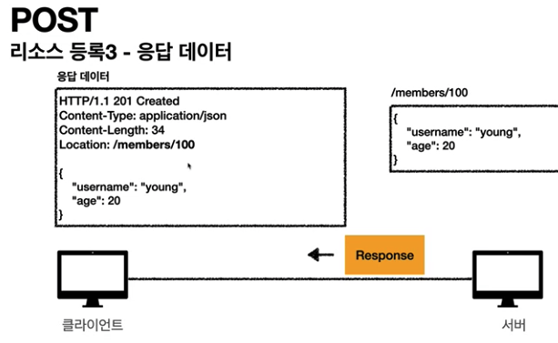

# HTTP 메서드

- HTTP API 만들어보기
- HTTP 메서드 - GET, POST
- HTTP 메서드 - PUT, PATCH, DELETE
- HTTP 메서드의 속성
- HTTP 메서드 활용

* * *

## 4-1. HTTP API 설계   URI(Uniform Resource Identifier)

* API URI 설계 시 가장 중요한 것은 **리소스를 식별**하는 것이다.
    - URI는 리소스만 식별해야한다.
        - URI 계층 구조 사용
            - ex. 회원 목록 조회 /members, 회원 조회 /members/{id}
    - 리소스와 해당 리소스를 대상으로 하는 행위를 분리해야한다.
        * 리소스 = 회원
        * 행위 = 조회, 등록, 삭제, 변경

    * 리소스는 명사, 행위는 동사
    * 행위(메서드)는 어떻게 구분?
        - HTTP 메서드를 사용해서 구분한다.

## 4-2. GET, POST

### GET

- 리소스 조회
- 서버에 데이터를 전달할 때는 query(쿼리 파라미터, 쿼리 스트링)를 통해서 전달

### POST

* 클라이언트에서 메세지 바디를 통해 서버로 요청 데이터를 전달하면 서버는 요청 데이터를 처리함
* 전달된 데이터는 주로 신규 리소스 등록, 프로세스 처리에 사용
    - 단순히 데이터를 생성, 변경하는 것을 넘어서 프로세스 처리에도 사용된다.
        - ex. 결제 완료 -> 배달 시작 => 배달 완료 와 같은 **프로세스의 상태 변경**
        - POST /orders/{orderId}/start-delivery 와 같은 **컨트롤 URI**로도 사용된다.
* POST는 모든 처리가 가능
    - ex. JSON으로 조회 데이터를 넘겨야 하는데, GET 메서드를 사용하기 어려울 때

## 4-3. PUT, PATCH, DELETE

### PUT

* 리소스 대체
    - 리소스가 있으면 대체, 없으면 생성한다. 쉽게 말하면 고냥 덮어버리기
    - 클라이언트가 리소스의 위치를 알고 URI를 지정함, POST와의 차이점
        - ex. PUT /members/1

#### ⚠️ 리소스를 완전히 대체하는 것을 주의!

- 기존 리소스를 완전히 대체하기 때문에 기존 리소스가 지워진다.
    - ex. { username: "name", age: 20 }  
      PUT { age: 22 }  
      => { age: 22 } (username 지워짐)

### PATCH

* 리소스 부분 변경
    - ex. { username: "name", age: 20 }  
    PUT { age: 22 }  
    => { username: "name", age: 22 } (age 부분 변경)
* PATCH를 지원 안하는 서버에서는 POST를 사용, POST는 무적임

### DELETE

* 리소스 제거

## 4-4. HTTP 메서드의 속성

### 안전, Safe

* 호출해도 리소스가 변경되지 않는 것
    - 안전은 대상 리소스가 변하는가 아닌가만 고려함

### 멱등, Idempotent

* 한 번 호출하든 여러번 호출하든 결과가 같은 것
* 멱등 메서드
    - GET, PUT, DELETE
    - POST는 멱등하지 않다. 결제를 두번하면 중복 결제 발생
* 멱등은 외부 요인으로 중간에 리소스가 변경되는 것 까지는 고려하지 않는다.
    - ex. 사용자 1이 데이터를 조회할 때(GET) 사용자 2가 데이터를 수정(PUT)해서 사용자 1이 같은 요청을 호출했을 때 사용자 1에게 사용자2의 영향으로 바뀐 데이터가 보여지는 상황

### 캐시 가능, Cacheable

* 응답 결과 리소스를 캐시해서 사용
    - 주로 GET, HEAD 정도만 캐시로 사용함
    - POST, PATCH는 본문 내용까지 캐시 키로 고려해야 하는데, 구현이 쉽지 않음

## 4-5. HTTP 메서드 활용

### 클라이언트에서 서버로 데이터 전송

* 쿼리 파라미터를 통한 전송 (GET)
    - 주로 정렬 필터(검색어)
* 메세지 바디를 통한 전송 (POST, PUT, PATCH)
    - 회원 가입, 상품 주문, 리소스 등록, 변경

#### ☃️ 4가지 상황

* 정적 데이터 조회
    - 이미지, 정적 텍스트 문서
* 동적 데이터 조회
    - 주로 검색, 목록 정렬 필터
* HTML Form 데이터 전송
    - POST 전송 - 저장
        - Content-Type은 **application/x-www-form-urlencoded**로 쿼리 파라미터와 거의 동일한 형식으로 서버에 전송함
    - GET 전송 - 저장
        - GET은 URL 경로에 쿼리 파라미터로 서버에 전송함
        - 데이터 저장 시엔 GET 메서드 사용 🙅‍️
    - enctype=multipart/form-data
        - 주로 파일 업로드 같은 바이너리 데이터를 전송할 때 사용함
        - 다른 종류의 여러 파일과 폼 내용 함께 전송 가능(= multipart)
* HTTP API 데이터 전송
    - 서버 to 서버, 백엔드 시스템 통신
    - 앱 클라이언트(아이폰, 안드로이드)에서도 사용됨
    - 웹 클라이언트
        - HTML에서 form 전송 대신 JS를 통한 통신에 사용(AJAX)
        - 리액트 뷰와 같은 웹 클라이언트와 API 통신
    - Content-Type: application/json을 주로 사용

### HTTP API 설계 예시

* POST, PUT 기반의 등록 구분
* HTML FORM 활용, GET과 POST만 가능

#### ✅ API 설계 - POST 기반 등록

ex. 멤버 관리 시스템

* 클라이언트는 둥록될 리소스의 URI를 모른다.
    - POST /members
* 서버가 새로 등록된 리소스 URI를 생성한다.
    - HTTP/1.1 201 Created  
      Location: /members/100
* => **컬렉션(Collection)**
    - 서버가 관리하는 리소스 디렉토리

#### ✅ API 설계 - PUT 기반 등록

ex. 파일 관리 시스템

* 클라이언트가 리소스 URI를 알고 있어야 한다.
    - 파일 등록, PUT /files/star.jpg
* 클라이언트가 직접 리소스의 URI를 지정한다.
* => **스토어(Store)**
    - 클라이언트가 관리하는 자원 저장소

#### ✅ HTML FORM 사용

* **컨트롤 URI(동사로 된 리소스 경로)**
    - GET, POST만 지원하므로 제약이 있다.
    - 이런 제약을 해결하기 위해 컨트롤 URI를 사용한다.
    - HTTP 메서드로 해결하기 애매한 경우만 사용한다.
        - 컨트롤 URI ex. POST /new, /edit, /delete

