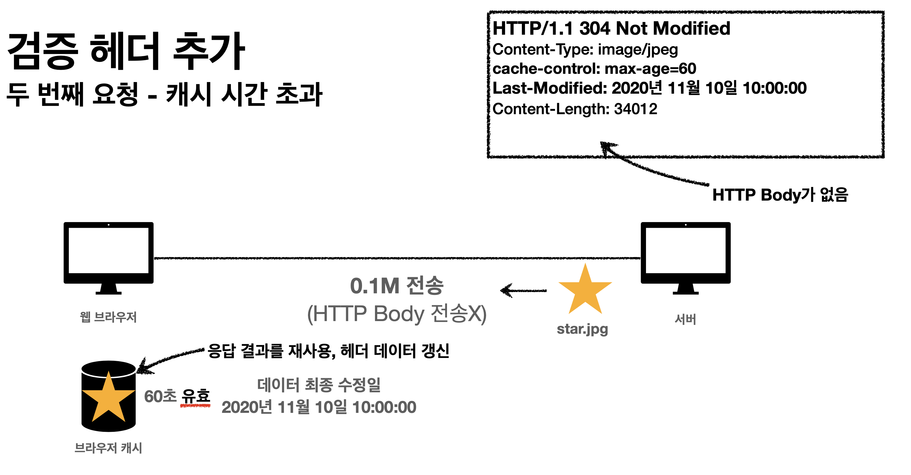

# HTTP 헤더

* 일반 헤더
* 캐시와 조건부 요청

* * *

## 6-1. HTTP 헤더

> 용도: HTTP 전송에 필요한 모든 부가 정보

### # 표현

* 표현은 요청이나 응답에서 전달할 실제 데이터
* 표현 헤더는 표현 데이터를 해석할 수 있는 정보 제공

```
Content-Type: 표현 데이터 형식
Content-Encoding: 표현 데이터 압축 방식
Content-Language: 표현 데이터 자연 언어
Content-Length: 표현 데이터의 길이
```

### # 협상(콘텐츠 네고시에이션)

* 클라이언트가 선호하는 표현 요청, 클라이언트가 원하는 표현으로 서버에게 달라고 요청하는 것
* 요청시에만 사용

```
Accept: 클라이언트가 선호하는 미디어 타입 전달 
Accept-Charset: 클라이언트가 선호하는 문자 인코딩 
Accept-Encoding: 클라이언트가 선호하는 압축 인코딩 
Accept-Language: 클라이언트가 선호하는 자연 언어
```

#### 협상과 우선순위(Quality Values(q))

* q 값 사용, 0~1 클수록 높은 우선순위
    - 생략하면 1
* 구체적인 것이 우선한다.
    - 구체적인 것을 기준으로 미디어 타입을 맞춤

### # 전송 방식

* 단순 전송, Content-Length

```
    HTTP/1.1 200 OK
    Content-Type: text/html;charset=UTF-8 
    Content-Length: 3423
    
    <html> 
        <body>...</body>
    </html>
```

* 압축 전송, Content-Encoding

```
    HTTP/1.1 200 OK
    Content-Type: text/html;charset=UTF-8 
    Content-Encoding: gzip 
    Content-Length: 521
    
    lkj123kljoiasudlkjaweioluywlnfdo912u34ljko98udjkl
```

* 분할 전송, Transfer-Encoding
    - Content-Length를 보내면 안됨, 예측 불가능

```
    HTTP/1.1 200 OK 
    Content-Type: text/plain 
    Transfer-Encoding: chunked
    
    5
    Hello 
    5 
    World 
    0
    \r\n
```

* 범위 전송, Range, Content-Range

```
    HTTP/1.1 200 OK
    Content-Type: text/plain 
    Content-Range: bytes 1001-2000 / 2000
    
    qweqwe1l2iu3019u2oehj1987askjh3q98y
```

### # 일반 정보

* Form, 유저 에이전트의 이메일 정보
* Referer, 이전 웹 사이트 주소
    - 현재 요청된 페이지으 이전 웹 페이지 주소
    - 유입 경로 분석할 때 주로 사용
* User-Agent, 클라이언트의 애플리케이션 정보(웹 브라우저의 정보, 등)
    - 어떤 종류의 브라우저에서 장애가 발생하는지 파악 가능
    - 동계 정보
* Server, 요청을 처리하는 ORIGIN 서버의 소프트웨어 정보
    - 응답에서 사용
* Date, 메세지가 발생한 날짜와 시간
    - 응답에서 사용

### # 특별한 정보

* Host, 요총한 호스트 정보(도메인)
    - 필수 헤더
    - 하나의 서버가 여러 도메인을 처리할 때
* Location, 페이지 리다이렉션
    - 3xx 응답의 결과에 Location 헤더가 있으면 해당 위치로 자동 이동
* Allow, 허용 가능한 HTTP 메서드
* Retry-After, 유저 에이전트가 다음 요청을 하기까지 기다려야 하는 시간
    - 503, 서비스가 언제까지 불능인지 알려줄 수 있다
    - 날짜 표기 or 초단위 표기

### # 인증

* Authorization, 클라이언트 인증 정보를 서버에 전달
    - 인증 방식에 따라 값이 다르다.
* WWW-Authenticate, 리소스 접근시 필요한 인증 방법 정의
    - 401 응답과 함께 사용

### # 🍪 쿠키

* Set-Cookie, 서버에서 클라이언트로 쿠키 전달(응답)
* Cookie, 클라이언트가 서버에서 받은 쿠키를 저장하고, HTTP 요청시 서버로 전달
* HTTP는 무상태 프로토콜이다. 요청과 응답을 주고 받으면 연결을 끊는다. 이전 요청을 기억하지 못하기 때문에 쿠키를 사용해서 사용자 정보를 저장한다.

#### 생명주기, Expires, max-age

- expires=Sat, 26-Dec-2020 04:39:21 GMT
    - 만료일이 되면 쿠키 삭제
- max-age=3600
    - 0이나 음수를 지정하면 쿠키 삭제
- 세션 쿠키: 브라우저 종료 시까지 유지
- 영속 쿠기: 만료 날짜를 입력하면 해당 날짜까지 유지

#### 보안, Secure, HttpOnly, SameSite

- Secure, https인 경우에만 전송
- HttpOnly, XSS 공격 방지 JS에서 접근 불가, HTTP 전송에만 사용
- SameSite, XSRF 공격 방지, 요청 도메인과 쿠키에 설정된 도메인이 같은 경우에만 전송

## 6-2. 캐시와 조건부 요청

### 캐시

* 캐시를 적용하면 비싸고 느린 인터넷 네트워크의 사용량을 줄일 수 있다. 그러면 브라우저 로딩 속도가 빨라지고 빠른 사용자 경험을 제공할 수 있다.
* 캐시 시간이 초과되면 서버를 통해 다시 데이터를 조회하고 캐시를 갱신하기 때문에 네트워크 다운로드가 발생한다.

### 검증 헤더와 조건부 요청

* 캐시 시간 초과
    * 캐시 유효 시간이 초과해서 서버에 다시 요청하면 두 가지 상황이 나타남
        1. 서버에서 기존 데이터를 변경 🌜 -> 🌛
        2. 서버에서 기존 데이터를 변경하지 않음 🌜

#### 검증 헤더

* 캐시 데이터와 서버 데이터가 같은지 검증하는 데이터
* Last-Modified
    - 데이터가 마지막에 수정된 최종 수정일을 표기 (UTC 표기법 사용)
        - 브라우저 캐시에 응답 값을 저장
* ETag
  - 캐시용 데이터에 임의의 공유 버전 이름 적용
  - 데이터가 변경되면 이 이름을 바꿔서 변경함 (Hash 재생성)
  - 클라이언트 입장에서 ETag만 보내서 같으면 유지(캐시), 다르면 다시 받기

#### 조건부 요청

* 검증 헤더로 조건에 따른 분기
* If-Modified-Since, If-Unmodified-Since: Last-Modified 사용
  - 이후에 데이터가 수정되었으면?
    - 미변경 시
        - 캐시의 데이터 최종 수정일과 서버의 최종 수정일로 데이터를 판단,
        - 데이터가 갱신되지 않았다면 서버는 304 Not Modified + 헤더 메타 정보만 응답한다. HTTP Body는 전송하지 않는다.
        - 헤더 부분만 전송하기 때문에 네트워크 부하 감소, 전송 용량 0.1M
    - 변경 시
      - 200 OK, 모든 데이터를 전송한다. 
      - 전송 용량 1.1M (헤더 0.1M 바디 1.0M)
* if-None-Match, if-Match: ETag 사용
* 조건이 만족하면 200, 만족하지 않으면 304 Not Modified

